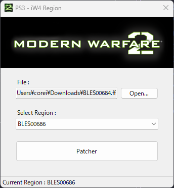

  

  <h3 align="center">PS3-iW4Region</h3>

  
PS3 Mw2 patch.ff region change tools

  

    <a href="https://github.com/coreizer/PS3-iW4Region/issues">Report Bug</a>
    ・
    <a href="https://github.com/coreizer/PS3-iW4Region/issues">Request Feature</a>
  

  
Table of Contents

  <ol>
    <li><a href="#👀-featured">Featured</a></li>
    <li><a href="#🖼️-screenshot">Screenshot</a></li>
    <li><a href="#🙏-additional-resources-and-thanks">Additional resources and thanks</a></li>
    <li><a href="#👷-author">Author</a></li>
    <li><a href="#🌏-stay-in-touch">Stay In Touch</a></li>
    <li><a href="#⚖️-license">License</a></li>
  </ol>

## 👀 Featured

- patch.ff region

## 🖼️ Screenshot

## 🌏 Stay In Touch

- [Website (coreizer.dev)](https://www.coreizer.dev)
- [Twitter](https://www.twitter.com/coreizer)

## 👷 Author

- coreizer

## ⚖️ License

This project is licensed under [GPL v3.0](https://opensource.org/license/lgpl-3-0/). See [License File](LICENSE) for details.
